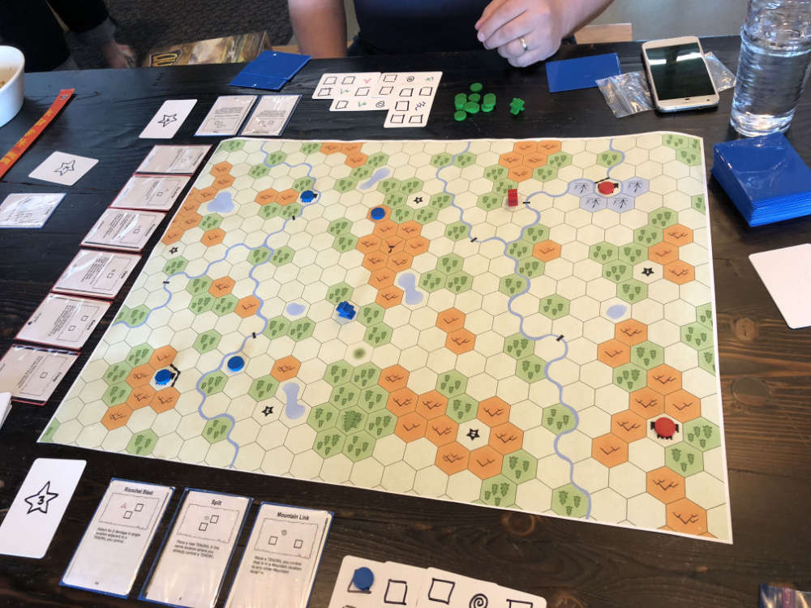

# Playtest #7

Mon 11 June 2018

Participants: self, AdamB, JeffB

## Overview

* Testing:
   * Draft
   * Draft with 5 cards (chose small number on purpose, should it be bigger)
   * 11 Mana (chose smallish number on purpose, does it need to be more?)
* Score:
   * Jeff: 10
   * Adam: 13
   * Gary: 10

## Components

* [22x19 hex board](../img/playtest_5_map.jpg)
* 33 (double-sided) matrix cards
* Token for each player
* 11 Mana disks

## Setup

* Deck of double-sided tapestry cards with top card revealed
* All basic spell cards in shared area
* Players draft 5 spells

## Rules

Each turn, do each of the following:

* Remove a THREAD from Tapestry (if possible)
* Spend mana from Mana Pool

### Spending Mana

* 1 mana - move 1 space into field
* 2 mana - move 1 space into forest
* 3 mana - move 1 space into mountain
* 1 mana place as TENDRIL on your location on MAP
* 1 mana place as THREAD on TAPESTRY and cast spell if possible
* 2 AP - draw first Tapestry card
* 3 AP - draw second Tapestry card

### Drawing and Adding to Matrix

Take the top Tapestry card and set it aside.

At the end of your turn, add it to your Tapestry.
Any Threads that are covered by the new card
are removed from the Tapestry and added back into
your Mana Pool.

### Casting Spells

Take the specified number of disks from your Mana Pool and add them one at a time as Threads to your Tapestry

After each Thread is placed in the Tapestry, if that Thread completes a
spell fragment pattern, then that spell fragment
is cast and its effect happens immediately.

If multiple spell patterns are matched, you must choose one.

### Damage

Mages die when they take a single point of damage. They are sent to the Astral plane and must teleport back to the world. All Tendrils, Threads and Charges are removed and added back to the mage's Mana Pool.

## Scenario

Control (have a TENDRIL on) cities. Score a point at the end of your turn for each city that you have a TENDRIL on. First up to 15 wins.

## Comments

Clarify that Movement Points for Haste can be spent at any time during turn.

* For example: cast Haste while in astral plane before teleporting back

Jeff:

* NEG - TENDRIL warp (to terrain far away) is too strong. should be more restricted
* NEG - No protection at start
* NEG - After big turn, it's hard to recover Tapestry
* POS - Like draft. Private spells.
* POS - Tapestry
* POS - Spending action points: to move, buy cards

Adam:

* NEG - TENDRIL move spells are good. Need more TENDRIL "hate" spells. Spells that target opponent's TENDRILs. E.g., when a TENDRIL moves across the board, add a TENDRIL. Need more options to catch big TENDRIL moves
* NEG - Action points worked better than thought, but concerned about managing the spent mana (to keep distinct from unspent)
* POS - Draft. Perhaps 7 cards?
* NEG - Need more separation between elements. More differentiation.
* POS - Draft felt good
* Cards need more indication for the element that they're based on. A Fire card should have a lot of red so that when you look at your hand, you can tell at a glance which elements it is focused on.

Spells. Some did too much, some too little. But the balance overall felt fine.

Scores were roughly equal even though each mage felt very different and used different approaches.

Need more "hate" spells for TENDRILs. To affect other mage's TENDRILs.

TENDRIL move spells could be:

* move into larger forest
* move into forest of specific size
* move into forest exactly 1 larger

Start spells for starting locations:

* 5 is surrounded by forest, so a forest spell
* 2 is surrounded by mountains, so a mountain spell

Starting location 2 was surrounded by mountains which made it harder than other spaces to get out of.

## Suggestions/Actions

For next playtest:

* Fix death punishment
* Playtest more with these spells
